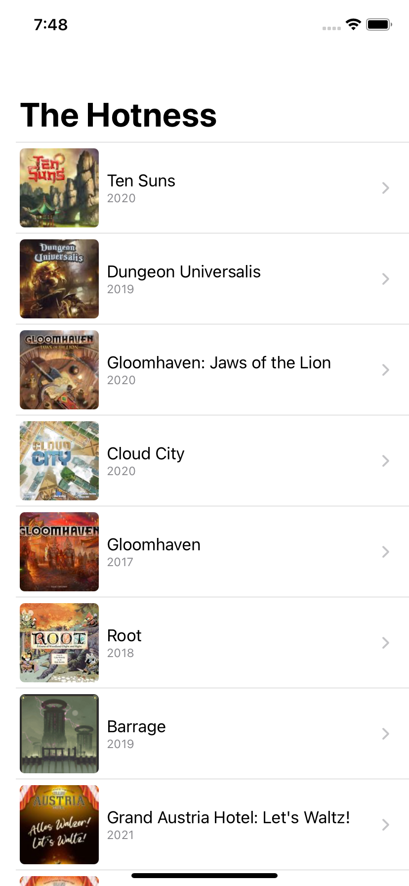
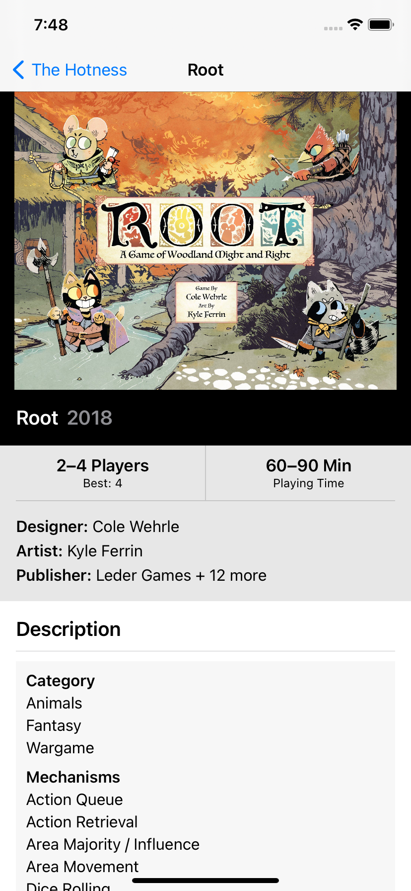
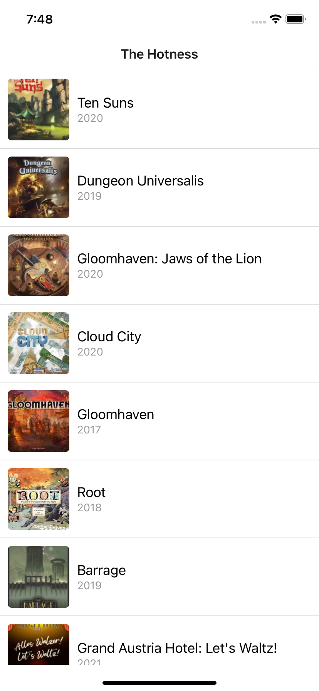
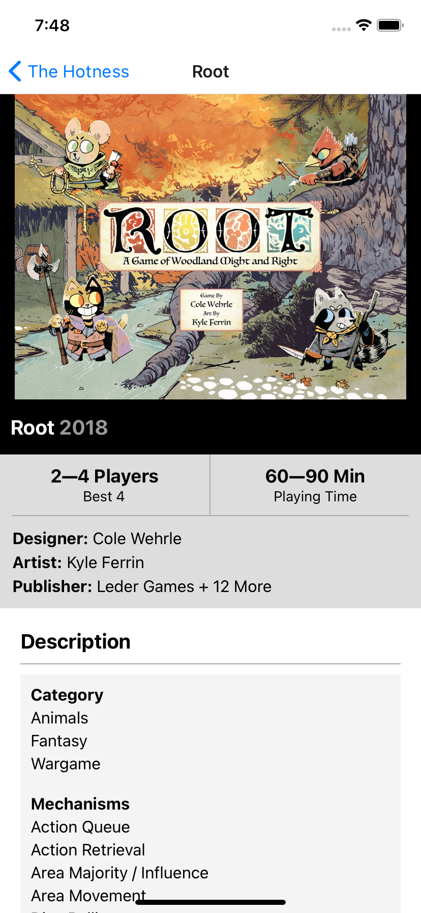
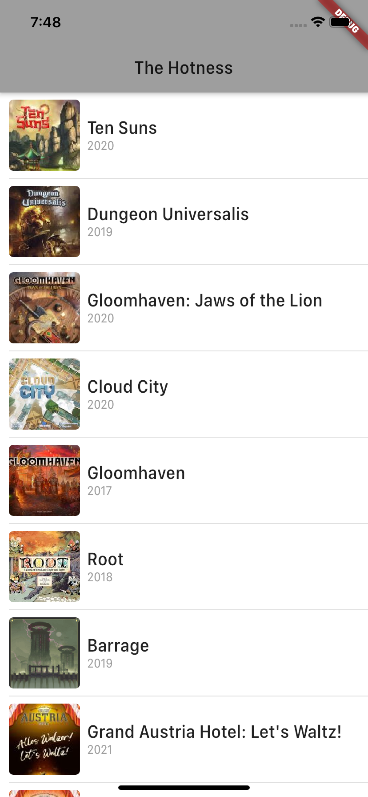
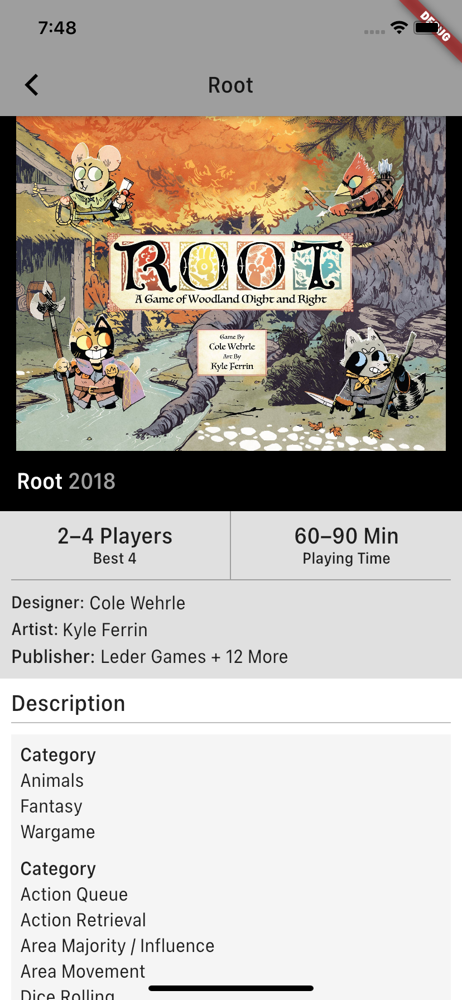

# Mobile App SDK Comparison 2020

Comparing the developer experience of mobile SDKs offering declarative UI.

## Contents

- [What](#what)
- [Why](#why)
- [What Is Declarative UI](#what-is-declarative-ui)
- [The App](#the-app)
- [Prerequisites for Running The Apps](#prerequisites-for-running-the-apps)
- [Running The Apps](#running-the-apps)
- [My Impressions](#my-impressions)
- [More Complex Things to Try](#more-complex-things-to-try)
- [Send Feedback](#send-feedback)

## What

This repo contains a simple mobile app written using three different mobile SDKs which have a **declarative UI**:

- **[SwiftUI](https://developer.apple.com/xcode/swiftui/)**
- **[React Native](https://reactnative.dev/)**
- **[Flutter](https://flutter.dev/)**

This allows comparing tooling, APIs, and the overall developer experience of the SDKs.

## Why

I wanted to try these mobile SDKs that have a **declarative UI**, and see how it feels to create an app with each one of them. I was interested in diving deeper into the developer experience with these tools, languages and libraries.

**SwiftUI** is the new hotness for cross-platform UIs on Apple platforms. **Flutter** promises a single cross-platform codebase for mobile, desktop, and web. **React Native** is familiar to React developers and enables deployment to both iOS and Android.

I chose these SDKs because of their modern **declarative UI** and hopefully better developer experience than what I've been used to with UIKit and standard Android. I have a strong background in native iOS and Android, but I haven't done any large projects with these mobile app technologies.

I wanted to create a simple app with all these SDKs to learn them better and see what it's like to start a new project with these techs in 2020. What comes out of the box, how easy is it to set up a new project, what else is needed for a simple real world app?

The aim is to create an app that looks and feels pretty much native. I've checked the apps on iOS, because SwiftUI is iOS-only, even though React Native and Flutter support cross-platform development. Looking at doing cross-platform (Android and iOS) would also be interesting, as would be learning [Jetpack Compose](https://developer.android.com/jetpack/compose).

## What Is Declarative UI

Declarative UI means I, as the programmer, declare how I want the UI to look, not how to build it. HTML is an example. Plain old HTML is just static. Declarative UIs start to shine, in my opinion, when things change and become dynamic. For example, in the old imperative way (UIKit), code has to keep references to view to update them. In declarative code, there's only the code that describes how the UI should look in each possible state. No more keeping track of views, no more multiple callbacks touching the same view and sometimes conflicting when timing is just right etc. Classes of problems just go away.

Below is a good example. What UI is shown depends on the state of the app. If `games` have been loaded, they're shown. If not, show spinner. No more "remove this view when loading ends, and then add these to the table view, oh and add the table view as well". Also notice there's not much layout specified here. SwiftUI has nice defaults, so the most common thing is the default, and thus the code can be very short.

```swift
    var body: some View {
        Group {
            if let games = games {
                LoadedGameList(games: games)
            } else {
                ProgressView()
            }
        }
    }
```

So in short, UI is a function of the app state (in a mathematical sense). Read more about declarative UI from [Flutter documentation](https://flutter.dev/docs/get-started/flutter-for/declarative).

## The App

The app is pretty simple, but typical mobile app. It has a list view and a detail view. The app shows [BoardGameGeek's The Hotness list](https://boardgamegeek.com/), and allows user to view details of each board game. I tried to make app functionality and code organization as similar as possible in all the apps.

Data is fetched from a custom proxy server sitting in front of [BGG XML Api 2](https://boardgamegeek.com/wiki/page/BGG_XML_API2). The server converts XML to JSON so the mobile app doesn't have to deal with XML.

The app has these features:

- Network requests
- JSON parsing
- List view
- View/screen navigation
- Image loading & scaling
- Somewhat complex text layout

Every complex mobile app has functionality like this, so I'm sampling a good portion of what it feels like to develop a real app with these technologies.

### SwiftUI

List View | Detail View
:--------:|:-----------:
 | 

### React Native

List View | Detail View
:--------:|:-----------:
 | 

### Flutter

List View | Detail View
:--------:|:-----------:
 | 


## Prerequisites for Running The Apps

You'll need to have these tools installed. I have the versions listed.

- Xcode 12.0.1
- Flutter 1.20.4
- React Native 0.63.2
- Node.js v13.14.0
- npm 6.14.4
- Docker v19.03.12 (for running the server)

Please refer to the documentation of those tools on how to install them.

## Running The Apps

### Starting Server

You need the server running before launching the mobile apps. Server is made with Node.js and is configured to run in Docker. You can also run it locally, but I don't have instructions or configuration for that.

```
cd Server
docker build -t mobile-server-2020 .
docker run -e DEBUG=1 -e PORT=6000 -p 38651:6000 -d mobile-server-2020
```

### Running SwiftUI App

Open `SwiftUI/TheHotnessSwiftUI.xcodeproj` and run the project (Cmd-R).

### Running React Native App

```
cd ReactNative
npm install
npx pod-install
npx react-native run-ios
npx react-native start
```

### Running Flutter App

Launch iPhone Simulator.

```
cd Flutter
flutter run
```

# My Impressions

Overall I found all of these SDKs to be easy to set up and use to create the sample app. I think all of them were equally easy to create this app.

Using UI toolkit which uses a declarative UI feels really great. All SDKs have a great story there. Building the app and UI was pretty fast, a few hours per app. Once I had everything for the list view, building the detail view was fast.

Composability was great with all the SDKs. It was easy first build the UI as one big blob and then split it up for easier understandability and any possible reuse. This is much better than `UIViewController` or `Activity`/`Fragment` composition.

All SDKs had their own quirks with regards to how to get the layout to what I wanted. With experience I would think they're all capable, fast and easy to use.

I think I like SwiftUI the most: good defaults and nice syntax means there's not much to code write, and view modifiers are a nice way of tuning layout. Modifiers also apply to whole subtrees, which may be handy sometimes. The language (Swift) has nice features and I feel SwiftUI is a good library, albeit it seems to be somewhat deep and complex when looking at everything it offers. I mean, complex animations etc. seem to be possible, looking at examples on the Internet, but they don't seem to be so easy to write, for a novice. Simple things are mostly simple, however. Apps feel very native, but SwiftUI doesn't work on Android, so there's that.

Overall developer experience was best with React Native. Hot reload worked great and made development fast and fun, app looked ok (out of the box), code for layout structure wasn't too verbose, and styling & tuning look and layout was clean and easy to do with `StyleSheet`. TypeScript feels a nice, clean and modern language. React Native's API feels clean and simple.

Unfortunately Flutter wasn't that impressive to me. It's developer experience didn't feel better in any area than either of the other choices. Hot reload was much better than SwiftUI's, but not better than React Native's. Language and library weren't as good IMO. Overall Flutter seems good, but it just doesn't excite me at all. The two other SDKs feel interesting, but this is a very personal opinion.

I've included a sample view for each language below. It's the row view used to display a single game in the list. SwiftUI has the shortest code.

The technologies have their strengths and weaknesses, mostly relating to supporting (or not supporting) multiple platforms (with varying levels of grace). Also getting little details just right for each platform will be more difficult the further away the SDK is from the platform conceptually. So the question becomes, what kind of an app are you building?

## SwiftUI

```swift
struct GameRow: View {
    let game: Game
    
    var body: some View {
        HStack {
            RoundedThumbnail(url: game.thumbnailUrl)
            VStack(alignment: .leading) {
                Text(game.name)
                Text(game.yearPublished)
                    .font(.caption)
                    .foregroundColor(.secondary)
            }
            .padding(.trailing)
        }
    }
}
```

#### Good

- 👍 The future of native iOS.
- 👍 First class citizen on iOS.
- 👍 Fully native UI with platform look & feel (on iOS).
- 👍 Code looks pretty clean with minimal boilerplate. Perhaps has the best defaults for layout code.
- 👍 Usable on all Apple platforms.
- 👍 Doesn't bloat the app with tons of library code.

#### Could be better

- 👎 Requires iOS 13 (or debatably 14).
- 👎 Is still very much under development, unfinished in terms of how much of overall iOS SDKs support it.
- 👎 Hot reload is not quite at the level of Flutter and React Native.
- 👎 No Android or web.
- 👎 Project template doesn't include a `.gitignore` file. Easy to find on the web, but why not include by default?
- 👎 Documentation isn't quite there yet, though Apple has nice [sample projects](https://developer.apple.com/documentation/app_clips/fruta_building_a_feature-rich_app_with_swiftui) and [WWDC videos](https://developer.apple.com/videos/) are great.
- 👎 Layout has good defaults, but some things seem harder to grok. For example, getting the detail view image to fit width with maximum height was hard. By default `.frame(maxHeight: 300)` means the image will always be 300 points high. I had to add `fixedSize(horizontal: false, vertical: true)` after `maxHeight` to make the image view shrink in height when it wasn't over 300 points high. Why? I don't still really understand. Other SDKs seemed to be easier to understand with regards to their layout model.
- 👎 State management is, well, somewhat complicated. `@State`, `@StateObject`, @ObservableObject` etc. The engineer in me appreciates all of these and what they do, but all these things bring complexity developers do have to deal with. Probably this all stems from Swift's value and reference semantics and their differences. I really love value semantics, but they seem to complicate things in SwiftUI.

## React Native

```typescript
export const GameRow = ({game}: {game: Game}) => {
  return (
    <View style={styles.gameRow}>
      <Image style={styles.thumbnail} source={{uri: game.thumbnailUrl}} />
      <View style={styles.textContainer}>
        <Text style={styles.title}>{game.name}</Text>
        <Text style={styles.yearPublished}>{game.yearPublished}</Text>
      </View>
    </View>
  );
};

const styles = StyleSheet.create({
  gameRow: {
    backgroundColor: Colors.white,
    padding: 10,
    flex: 1,
    flexDirection: 'row',
  },
  textContainer: {
    padding: 10,
    flex: 1,
    flexDirection: 'column',
    justifyContent: 'center',
  },
  thumbnail: {
    width: 80,
    height: 80,
    resizeMode: 'cover',
    borderRadius: 5,
    overflow: 'hidden',
  },
  title: {
    fontSize: 18,
  },
  yearPublished: {
    marginTop: 1,
    fontSize: 14,
    color: '#999',
  },
});
```
#### Good

- 👍 Very pleasant development experience.
- 👍 Clean API.
- 👍 Big community (lots of documentation, blogs, StackOverflow answers etc.).
- 👍 Documentation. Hooks documentation, for example, is just superb.
- 👍 Pretty clean layout code, separate styles (`StyleSheet.create()`) are a plus and a minus. I can't see the style inline with layout structure, but on the other hand the style is reusable.

#### Could be better

- 👎 Doesn't feel like a really cohesive whole.
- 👎 Need to know which libraries are the best for each use case to get all the things one needs in an app.
- 👎 TypeScript is great, but there are still hairy things from JS (equality comparison for example).
- 👎 Platform look & feel polish is not there, out of the box. I bet there are libraries to help with that.

## Flutter

```dart
class GameListRow extends StatelessWidget {
  GameListRow({Key key, this.game}) : super(key: key);

  final Game game;

  @override
  Widget build(BuildContext context) {
    return Container(
      child: Row(children: [
        ThumbnailView(thumbnailUrl: game.thumbnailUrl),
        Flexible(
            child: Container(
                margin: const EdgeInsets.only(left: 8),
                child: Column(
                  crossAxisAlignment: CrossAxisAlignment.start,
                  children: [
                    Text('${game.name}',
                        style: Theme.of(context).textTheme.headline6),
                    Text('${game.yearPublished}',
                        style: Theme.of(context)
                            .textTheme
                            .bodyText2
                            .apply(color: Colors.grey))
                  ],
                )))
      ]),
      decoration: BoxDecoration(
        border: Border(
          bottom: BorderSide(width: 1.0, color: Colors.grey.shade300),
        ),
        color: Colors.transparent,
      ),
    );
  }
}
```

#### Good

- 👍 Dart is easy to learn. It's a non-surprising language, which is a good thing.
- 👍 Probably closest to true cross-platfrom from one codebase.
- 👍 Feels more like a cohesive whole than React Native.

#### Could be better

- 👎 Flutter view APIs are a bit verbose. Maybe I just don't know all the tricks yet. With easy composition I could possily create my own API on top of the Flutter components to make building UIs a bit less verbose.
- 👎 Dart syntax feels a bit dated. Easy to learn, like Go, but I feel language design has evolved, and modern Swift or TypeScript is years ahead of Dart. Null safety isn't on par for 2020 IMO. Seems it's coming, but it's still a tech preview.
- 👎 There's a lot of boilerplate. JSON parsing, for example, is very tedious to write. This seems to be by design.
- 👎 Community feels much smaller than React Native or SwiftUI.
- 👎 Doesn't look like an iOS app straight from the box. Seems there are platform-specific themes, but I didn't look into those. On the other hand, real cross-platform support means the app probably just can't be very platform-specific in its look & feel.
- 👎 Overall very *meh* for me. App doesn't look like an iOS app, or even good, Dart feels a bit dated, Flutter view APIs feel verbose to use.

# More Complex Things to Try

Adding more things could really stress these SDKs to see how easy they are for making polished mobile apps:

- Proper error handling & retries for networking
- Polished platform UI look & feel
- Animations
- Text editing
- Image scaling and display
- Pull to refresh
- Complex navigation structure
- Video player
- Embedded web content
- Complex gesture interactions
- Rich, editable model on the client
- Biometric authentication
- Unit tests
- UI tests
- Push notifications
- etc.

It's the little platform look & feel things that take a lot of time to create. Cross-platform toolkits usually make it harder to get all the details right.

Implementing these things would increase my knowledge in the SDKs and how to create full-featured, rich and polished apps with them.

## Send Feedback

I'd like to hear your comments, improvement ideas, and other feedback. You can use [GitHub Issues](https://github.com/pkamppur/mobile-sdk-comparison-2020/issues) to suggest improvements. I can also be reached on Twitter: [@pkamppur](https://twitter.com/pkamppur).

